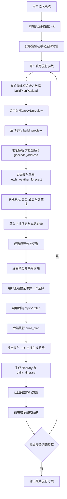

# 项目流程图

## 文字版流程图

```text
┌────────────────────┐
│      用户进入系统      │
└─────────┬──────────┘
          ↓
┌────────────────────┐
│   前端页面初始化 init   │
│  获取定位 / 加载默认信息 │
└─────────┬──────────┘
          ↓
┌────────────────────┐
│   用户填写旅行参数     │
│ 城市、日期、天数、预算 │
│ 偏好、出发城市、车站等 │
└─────────┬──────────┘
          ↓
┌────────────────────┐
│   用户选择或搜索地址   │
│  确定当前位置/目的地   │
└─────────┬──────────┘
          ↓
┌────────────────────┐
│ 前端构建预览请求数据   │
│   buildPlanPayload  │
└─────────┬──────────┘
          ↓
┌────────────────────┐
│ 调用后端 /api/v1/preview │
└─────────┬──────────┘
          ↓
┌────────────────────┐
│   后端接收预览请求     │
│    build_preview    │
└─────────┬──────────┘
          ↓
┌────────────────────┐
│   地址解析与地理编码   │
│   geocode_address   │
└─────────┬──────────┘
          ↓
┌────────────────────┐
│    查询天气信息      │
│ fetch_weather_forecast │
└─────────┬──────────┘
          ↓
┌────────────────────┐
│   获取景点/美食/酒店   │
│   候选 POI 数据      │
└─────────┬──────────┘
          ↓
┌────────────────────┐
│   获取交通信息/车站    │
│  12306 / 交通枢纽查询  │
└─────────┬──────────┘
          ↓
┌────────────────────┐
│   候选项评分与筛选     │
│ 景点、美食、酒店排序   │
└─────────┬──────────┘
          ↓
┌────────────────────┐
│   返回预览结果给前端   │
│ 候选项、天气、交通提示 │
└─────────┬──────────┘
          ↓
┌────────────────────┐
│ 用户查看候选结果并选择 │
│ 想去/想吃/不感兴趣等   │
└─────────┬──────────┘
          ↓
┌────────────────────┐
│ 调用后端 /api/v1/plan │
│   生成正式旅行方案    │
└─────────┬──────────┘
          ↓
┌────────────────────┐
│   后端执行 build_plan │
│ 综合天气、POI、交通等 │
└─────────┬──────────┘
          ↓
┌────────────────────┐
│   生成每日行程路线     │
│ itinerary / daily_itinerary │
└─────────┬──────────┘
          ↓
┌────────────────────┐
│   返回完整旅行方案     │
│ 概览、推荐、路线、预警 │
└─────────┬──────────┘
          ↓
┌────────────────────┐
│   前端展示最终结果     │
└─────────┬──────────┘
          ↓
┌────────────────────┐
│ 是否需要调整参数重生成 │
└───────┬───────┬────┘
        │是            │否
        ↓              ↓
┌────────────────────┐   ┌────────────────────┐
│ 返回参数填写与筛选页 │   │   输出最终旅行方案   │
└────────────────────┘   └────────────────────┘
```

## Mermaid 版流程图



## 简要说明

- 该项目采用“预览 + 正式生成”两阶段流程。
- `/api/v1/preview` 主要用于提前加载候选景点、美食、酒店和交通信息。
- `/api/v1/plan` 用于根据用户最终选择生成完整行程。
- 用户可以在结果页继续调整条件并重新生成路线。
